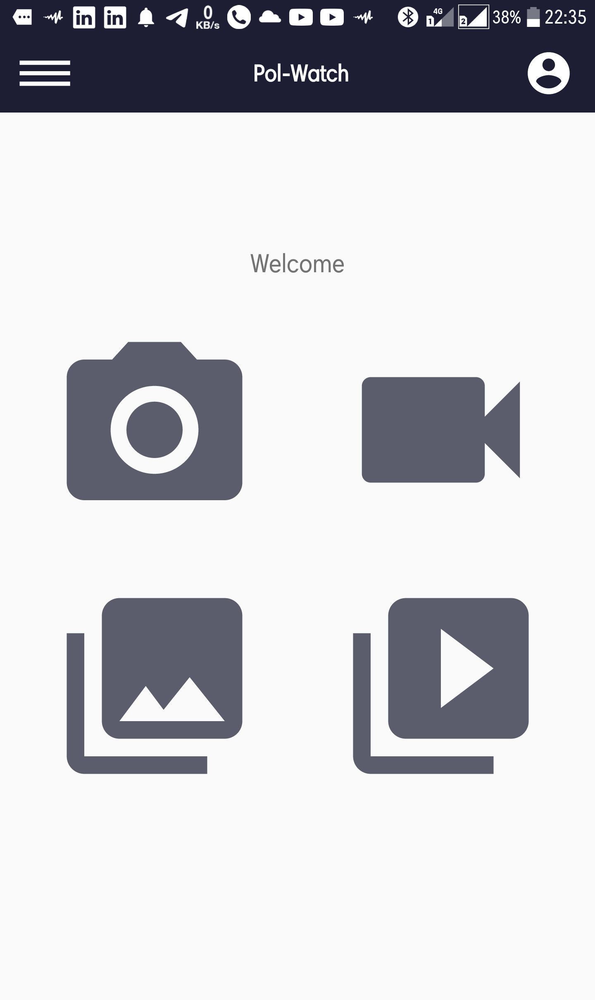

# Pol-Watch

A mobile app that records videos and captures photos and saaves with the exact location and time.

## Features

The project uses/teaches the following

* Retrofit
* User authentication (sign-up and sign-in)
* Navigation Drawer and navGraph
* Progressbar
* Geolocator
>location service to get the current location of the user
* AlertDialog
* CameraX Api for image capture and video recording

Screenshots of the project are as follows

